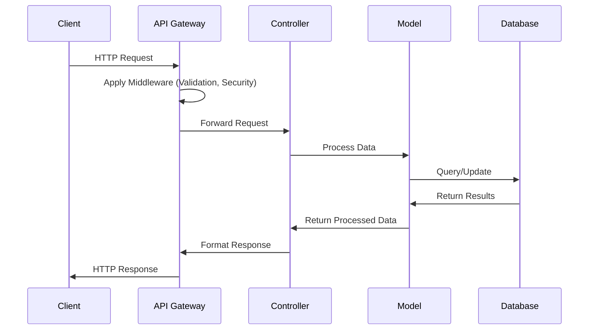
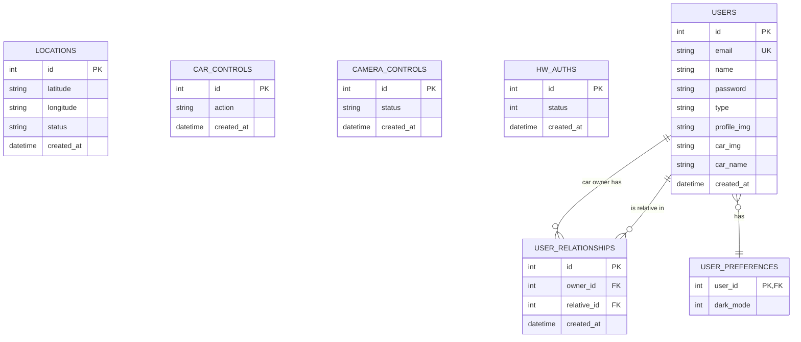
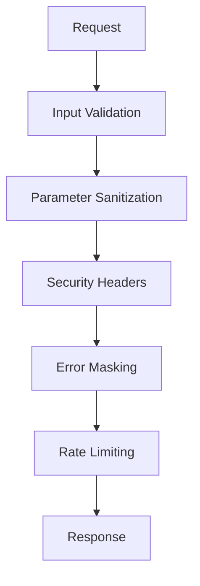
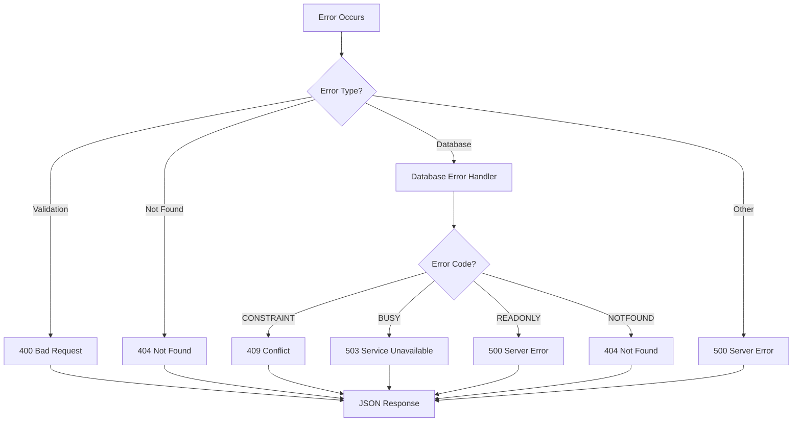
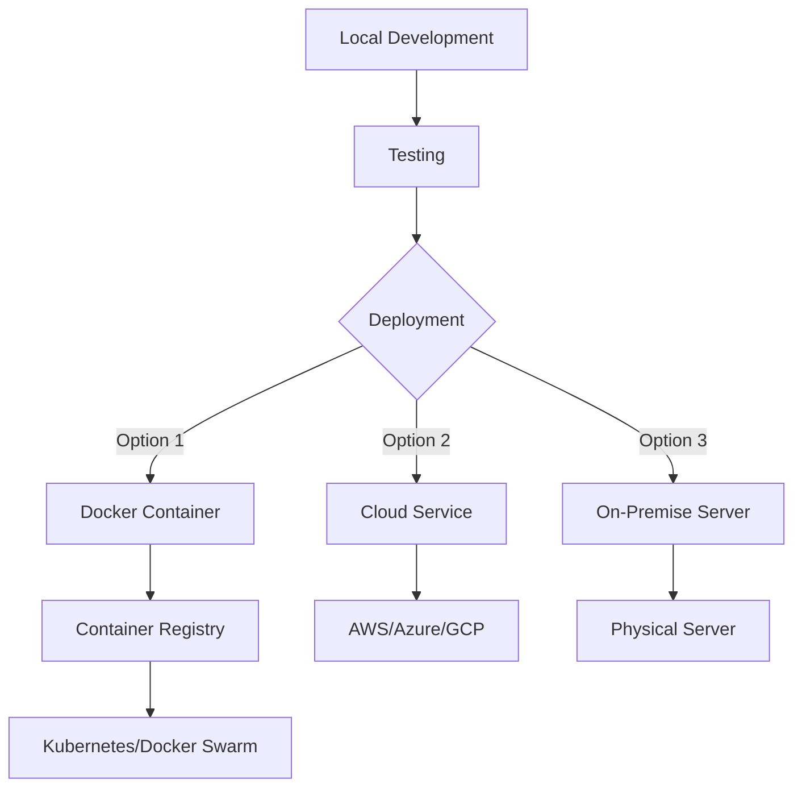

# Smart Vehicle Control System API

A comprehensive backend API for managing smart vehicle operations with real-time location tracking, camera control, and remote vehicle movement.


## Table of Contents

- [Overview](#overview)
- [System Architecture](#system-architecture)
- [Database Schema](#database-schema)
- [API Endpoints](#api-endpoints)
- [Security Features](#security-features)
- [Error Handling](#error-handling)
- [Setup and Deployment](#setup-and-deployment)
- [Performance Considerations](#performance-considerations)
- [Monitoring and Logging](#monitoring-and-logging)

## Overview

The Smart Vehicle Control System API provides a robust backend interface for controlling and monitoring autonomous vehicles. It enables:

- **Real-time Location Tracking**: Record and retrieve vehicle positions with status information
- **Remote Vehicle Control**: Send directional commands (forward, backward, left, right, stop)
- **Camera Management**: Toggle multiple onboard cameras independently or simultaneously
- **Hardware Authentication**: Secure vehicle access with authentication mechanisms

This system is ideal for:

- Autonomous delivery vehicles
- Remote inspection drones
- Security patrol vehicles
- Research and development platforms

## System Architecture

The backend follows a modular architecture with clear separation of concerns:

```
src/
  ├── config/        # Application and database configuration
  ├── controllers/   # Request handlers and business logic
  ├── models/        # Data models and validation
  ├── routes/        # API endpoint definitions
  ├── middleware/    # Request processing, validation, error handling
  ├── utils/         # Utility functions and helpers
  ├── db/            # Database initialization and migration
  └── server.js      # Application entry point
```

### Component Interaction Flow



## Database Schema

The system uses SQLite for data persistence with the following schema:

### Entity Relationship Diagram



### Tables Description

| Table              | Purpose                           | Fields                                                                      |
| ------------------ | --------------------------------- | --------------------------------------------------------------------------- |
| locations          | Stores vehicle position data      | id, latitude, longitude, status, created_at                                 |
| car_controls       | Records movement commands         | id, action, created_at                                                      |
| camera_controls    | Manages camera states             | id, status, created_at                                                      |
| hw_auths           | Tracks authentication status      | id, status, created_at                                                      |
| users              | Stores user account information   | id, email, name, password, type, profile_img, car_img, car_name, created_at |
| user_preferences   | Stores user interface preferences | user_id, dark_mode                                                          |
| user_relationships | Links car owners with relatives   | id, owner_id, relative_id, created_at                                       |

## API Endpoints

For detailed API documentation including request/response formats and examples, please see the [API Endpoints Reference](API_ENDPOINTS.md).

### Main API Endpoints Overview

- **User Management**

  - `POST /api/users/register` - Register a new user (car owner or relative)
  - `POST /api/users/login` - Login a user
  - `GET /api/users/profile` - Get user profile

- **User Preferences**

  - `GET /api/users/preferences` - Get user preferences
  - `PUT /api/users/preferences` - Update user preferences
  - `POST /api/users/preferences/toggle-dark-mode` - Toggle dark mode

- **Car Owner & Relative Management**

  - `GET /api/users/owner/relatives` - Get relatives linked to car owner
  - `POST /api/users/owner/relatives` - Add relative to car owner
  - `DELETE /api/users/owner/relatives/:relativeId` - Remove relative
  - `GET /api/users/relative/owners` - Get car owners linked to relative

- **Location Management**

  - `POST /api/location` - Save a new location
  - `GET /api/location` - Get the most recent location
  - `GET /api/location/all` - Get all locations
  - `GET /api/location/:id` - Get location by ID

- **Vehicle Control**

  - `POST /api/car-control` - Save a new car control action
  - `GET /api/car-control` - Get the most recent car control action
  - `GET /api/car-control/all` - Get all car control actions
  - `GET /api/car-control/:id` - Get car control action by ID

- **Camera Management**

  - `POST /api/camera-control` - Save a new camera control status
  - `GET /api/camera-control` - Get the most recent camera status
  - `GET /api/camera-control/all` - Get all camera statuses
  - `GET /api/camera-control/:id` - Get camera status by ID

- **Hardware Authentication**
  - `POST /api/hw-auth` - Save a new hardware authentication status
  - `GET /api/hw-auth` - Get the most recent authentication status
  - `GET /api/hw-auth/all` - Get all authentication statuses
  - `GET /api/hw-auth/:id` - Get authentication status by ID

### Car Control Action Values

| Value | Action  |
| ----- | ------- |
| 5     | stop    |
| 6     | forward |
| 7     | back    |
| 8     | right   |
| 9     | left    |

#### Example Request

```json
{
  "action": "6"
}
```

#### Example Response

```json
{
  "message": "Car control action saved successfully",
  "action": "6",
  "description": "forward",
  "id": 1
}
```

## Security Features

The API implements several security features:



- **Input Validation**: All request parameters and bodies are validated
- **Security Headers**:
  - `X-Content-Type-Options: nosniff` - Prevents MIME type sniffing
  - `X-Frame-Options: DENY` - Prevents clickjacking attacks
  - `X-XSS-Protection: 1; mode=block` - Enhances XSS protection
- **Error Masking**: Detailed error messages in development, generic messages in production
- **Parameter Sanitization**: Prevents SQL injection and other injection attacks

## Error Handling

The API provides comprehensive error handling:



### Error Response Format

```json
{
  "error": {
    "message": "Error description",
    "statusCode": 400,
    "type": "APIError",
    "path": "/api/car-control"
  }
}
```

### Common Error Status Codes

- `400` - Bad Request (invalid input)
- `404` - Not Found (resource doesn't exist)
- `409` - Conflict (constraint violation)
- `500` - Server Error (unexpected errors)
- `503` - Service Unavailable (database busy)

## Setup and Deployment

### Prerequisites

- Node.js (v14+ recommended)
- npm or yarn

### Installation

1. Clone the repository:

   ```
   git clone https://github.com/yourusername/smart-vehicle-api.git
   cd smart-vehicle-api
   ```

2. Install dependencies:

   ```
   npm install
   ```

3. Start the server:

   ```
   npm start
   ```

4. For development with auto-restart:
   ```
   npm run dev
   ```

### Environment Variables

Create a `.env` file in the root directory with the following variables:

```
PORT=3000
NODE_ENV=development
```

### Deployment Options



## Performance Considerations

- **Database Indexing**: All tables have indexed primary keys and timestamp fields
- **Connection Pooling**: Efficient database connection management
- **Caching**: Frequently accessed data can be cached
- **Pagination**: All list endpoints support pagination for large datasets

## Monitoring and Logging

The application includes comprehensive logging:

- **Request Logging**: All incoming requests are logged with timestamp, method, and URL
- **Error Logging**: Detailed error logs include stack traces in development mode
- **Graceful Shutdown**: Proper handling of server shutdown with connection cleanup

### Log Example

```
[2023-07-15T14:32:45.123Z] GET /api/location
[2023-07-15T14:32:45.234Z] POST /api/car-control
[2023-07-15T14:32:45.345Z] ERROR: Invalid action parameter - 400 Bad Request
```

## Database

The application uses SQLite with a file-based database (`database.db`). The database will be created automatically when you start the application for the first time.

## License

This project is licensed under the MIT License - see the LICENSE file for details.
