# Smart Vehicle Control System API

A comprehensive backend API for managing smart vehicle operations with real-time location tracking, camera control, and remote vehicle movement.


## Table of Contents

- [Overview](#overview)
- [System Architecture](#system-architecture)
- [Database Schema](#database-schema)
- [API Endpoints](#api-endpoints)
- [Security Features](#security-features)
- [Error Handling](#error-handling)
- [Setup and Deployment](#setup-and-deployment)
- [Performance Considerations](#performance-considerations)
- [Monitoring and Logging](#monitoring-and-logging)

## Overview

The Smart Vehicle Control System API provides a robust backend interface for controlling and monitoring autonomous vehicles. It enables:

- **Real-time Location Tracking**: Record and retrieve vehicle positions with status information
- **Remote Vehicle Control**: Send directional commands (forward, backward, left, right, stop)
- **Camera Management**: Toggle multiple onboard cameras independently or simultaneously
- **Hardware Authentication**: Secure vehicle access with authentication mechanisms

This system is ideal for:

- Autonomous delivery vehicles
- Remote inspection drones
- Security patrol vehicles
- Research and development platforms

## System Architecture

The backend follows a modular architecture with clear separation of concerns:

```
src/
  ├── config/        # Application and database configuration
  ├── controllers/   # Request handlers and business logic
  ├── models/        # Data models and validation
  ├── routes/        # API endpoint definitions
  ├── middleware/    # Request processing, validation, error handling
  ├── utils/         # Utility functions and helpers
  ├── db/            # Database initialization and migration
  └── server.js      # Application entry point
```

### Component Interaction Flow

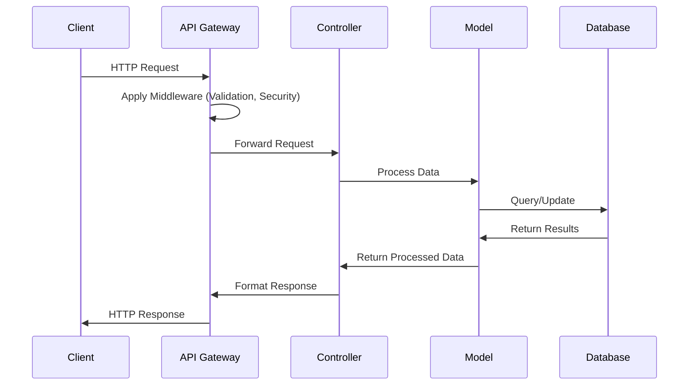

## Database Schema

The system uses SQLite for data persistence with the following schema:

### Entity Relationship Diagram

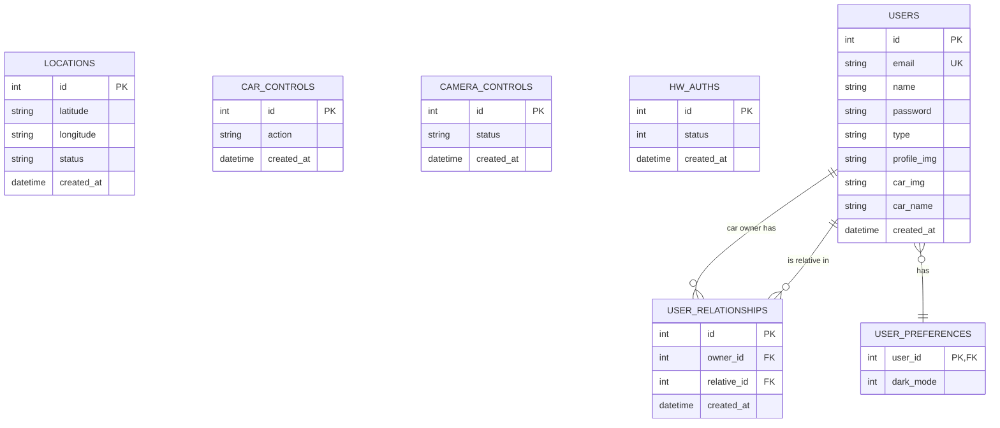

### Tables Description

| Table              | Purpose                           | Fields                                                                      |
| ------------------ | --------------------------------- | --------------------------------------------------------------------------- |
| locations          | Stores vehicle position data      | id, latitude, longitude, status, created_at                                 |
| car_controls       | Records movement commands         | id, action, created_at                                                      |
| camera_controls    | Manages camera states             | id, status, created_at                                                      |
| hw_auths           | Tracks authentication status      | id, status, created_at                                                      |
| users              | Stores user account information   | id, email, name, password, type, profile_img, car_img, car_name, created_at |
| user_preferences   | Stores user interface preferences | user_id, dark_mode                                                          |
| user_relationships | Links car owners with relatives   | id, owner_id, relative_id, created_at                                       |

## API Endpoints

### Location Management

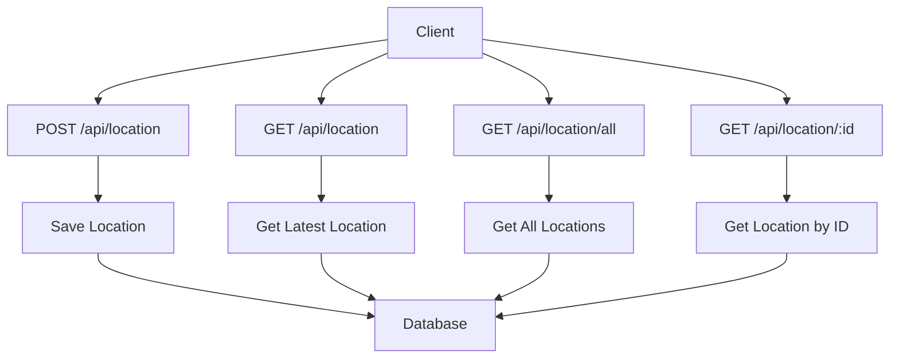

- `POST /api/location` - Save a new location
  - Required body: `{ "latitude": "37.7749", "longitude": "-122.4194", "status": "active" }`
  - Status values: "active", "idle", "emergency", "maintenance", etc.
- `GET /api/location` - Get the most recent location entry
- `GET /api/location/all` - Get all location entries
- `GET /api/location/:id` - Get location by ID

### Vehicle Control

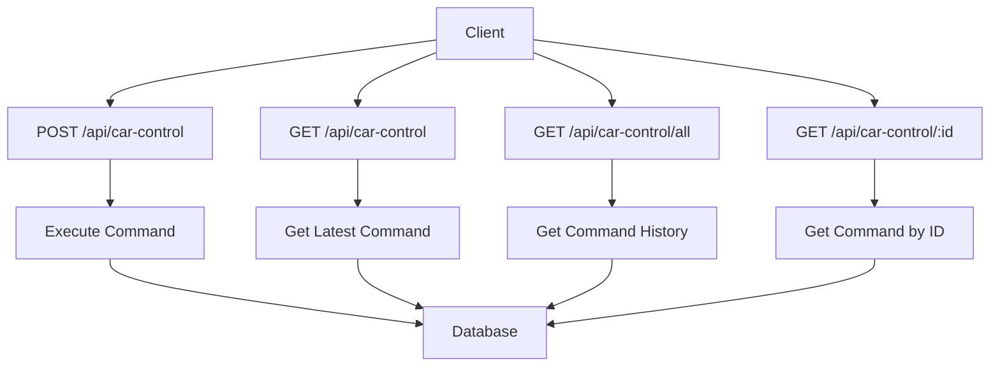

- `POST /api/car-control` - Save a new car control action
  - Required body: `{ "action": "1" }`
  - Valid actions:
    - `1` - Forward movement
    - `2` - Backward movement
    - `3` - Right turn
    - `4` - Left turn
    - `5` - Emergency stop
- `GET /api/car-control` - Get the most recent car control action
- `GET /api/car-control/all` - Get all car control actions
- `GET /api/car-control/:id` - Get car control action by ID

### Camera Management

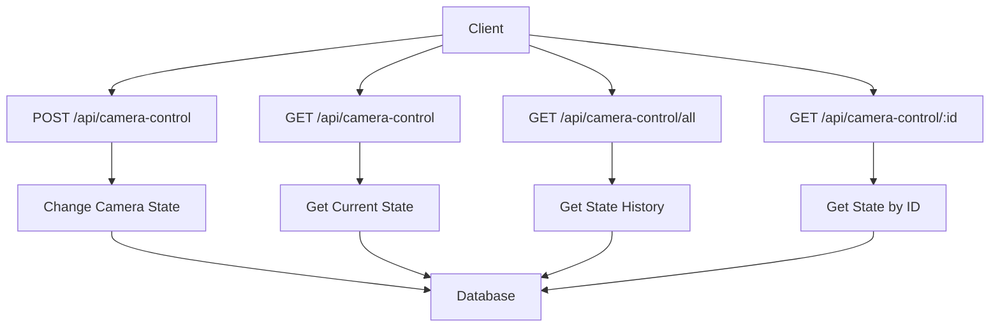

- `POST /api/camera-control` - Save a new camera control status
  - Required body: `{ "status": 11 }`
  - Valid status codes:
    - `11` - First camera on
    - `12` - First camera off
    - `13` - Second camera on
    - `14` - Second camera off
    - `15` - Both cameras on
    - `16` - Both cameras off
- `GET /api/camera-control` - Get the most recent camera control status
- `GET /api/camera-control/all` - Get all camera control statuses
- `GET /api/camera-control/:id` - Get camera control status by ID

### Hardware Authentication

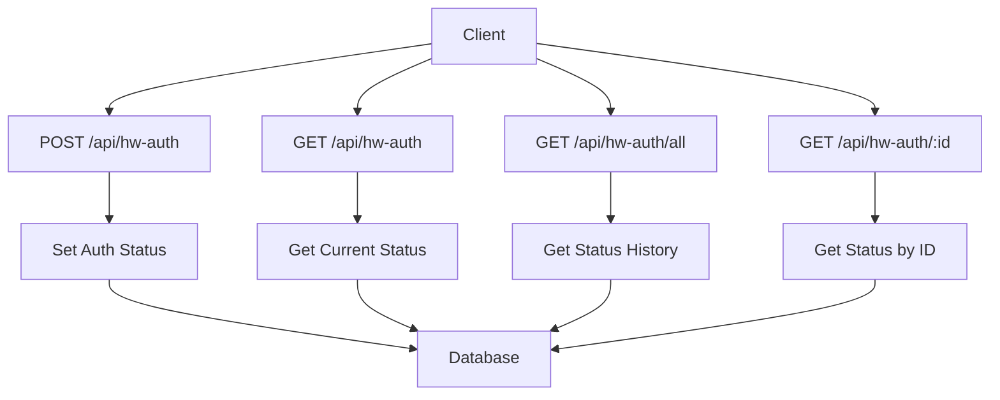

- `POST /api/hw-auth` - Save a new hardware authentication status
  - Required body: `{ "status": 1 }`
  - Valid status values:
    - `1` - Authenticated (vehicle is authorized to operate)
    - `0` - Not authenticated (vehicle is locked)
- `GET /api/hw-auth` - Get the most recent authentication status
- `GET /api/hw-auth/all` - Get all authentication statuses
- `GET /api/hw-auth/:id` - Get authentication status by ID

### User Management

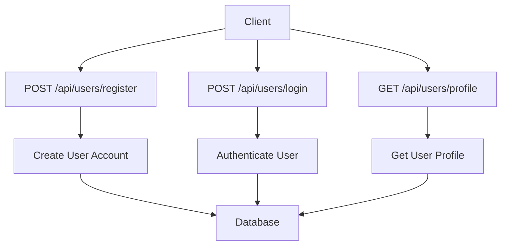

- `POST /api/users/register` - Register a new user

  - Required body for car owner: `{ "email": "owner@example.com", "name": "Car Owner", "password": "password123", "type": "car_owner", "car_name": "My Car" }`
  - Required body for relative: `{ "email": "relative@example.com", "name": "Relative User", "password": "password123", "type": "relative" }`
  - Optional fields for car owner: `profile_img`, `car_img`
  - Returns authentication token

- `POST /api/users/login` - Login an existing user

  - Required body: `{ "email": "user@example.com", "password": "password123" }`
  - Returns authentication token and user details

- `GET /api/users/profile` - Get current user profile
  - Requires authentication token
  - Returns user details

### Car Owner & Relative Management

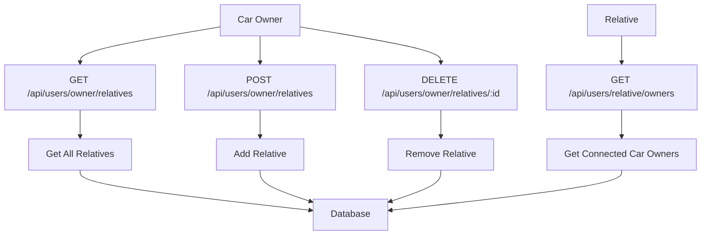

- `GET /api/users/owner/relatives` - Get all relatives linked to car owner

  - Requires authentication token (car owner only)
  - Returns list of relative users

- `POST /api/users/owner/relatives` - Add relative to car owner

  - Requires authentication token (car owner only)
  - Required body: `{ "relativeId": 123 }`

- `DELETE /api/users/owner/relatives/:relativeId` - Remove relative from car owner

  - Requires authentication token (car owner only)

- `GET /api/users/relative/owners` - Get all car owners linked to a relative
  - Requires authentication token
  - Returns list of car owners with their details

### User Preferences

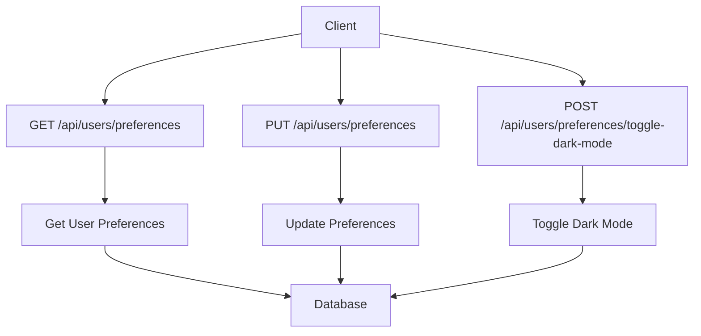

- `GET /api/users/preferences` - Get user preferences

  - Requires authentication token
  - Returns user preferences (dark_mode status)

- `PUT /api/users/preferences` - Update user preferences

  - Requires authentication token
  - Required body: `{ "dark_mode": true }`

- `POST /api/users/preferences/toggle-dark-mode` - Toggle dark mode
  - Requires authentication token
  - Toggles current dark_mode preference

## Security Features

The API implements several security features:

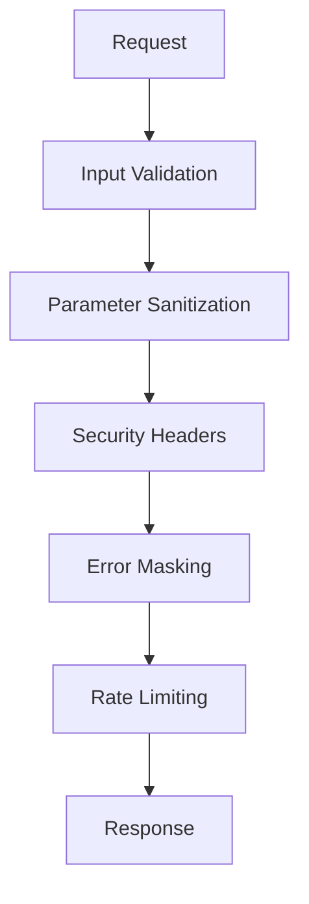

- **Input Validation**: All request parameters and bodies are validated
- **Security Headers**:
  - `X-Content-Type-Options: nosniff` - Prevents MIME type sniffing
  - `X-Frame-Options: DENY` - Prevents clickjacking attacks
  - `X-XSS-Protection: 1; mode=block` - Enhances XSS protection
- **Error Masking**: Detailed error messages in development, generic messages in production
- **Parameter Sanitization**: Prevents SQL injection and other injection attacks

## Error Handling

The API provides comprehensive error handling:

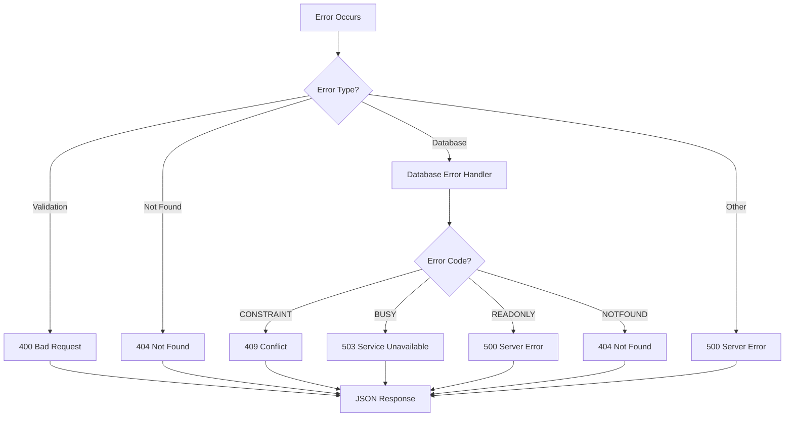

### Error Response Format

```json
{
  "error": {
    "message": "Error description",
    "statusCode": 400,
    "type": "APIError",
    "path": "/api/car-control"
  }
}
```

### Common Error Status Codes

- `400` - Bad Request (invalid input)
- `404` - Not Found (resource doesn't exist)
- `409` - Conflict (constraint violation)
- `500` - Server Error (unexpected errors)
- `503` - Service Unavailable (database busy)

## Setup and Deployment

### Prerequisites

- Node.js (v14+ recommended)
- npm or yarn

### Installation

1. Clone the repository:

   ```
   git clone https://github.com/yourusername/smart-vehicle-api.git
   cd smart-vehicle-api
   ```

2. Install dependencies:

   ```
   npm install
   ```

3. Start the server:

   ```
   npm start
   ```

4. For development with auto-restart:
   ```
   npm run dev
   ```

### Environment Variables

Create a `.env` file in the root directory with the following variables:

```
PORT=3000
NODE_ENV=development
```

### Deployment Options

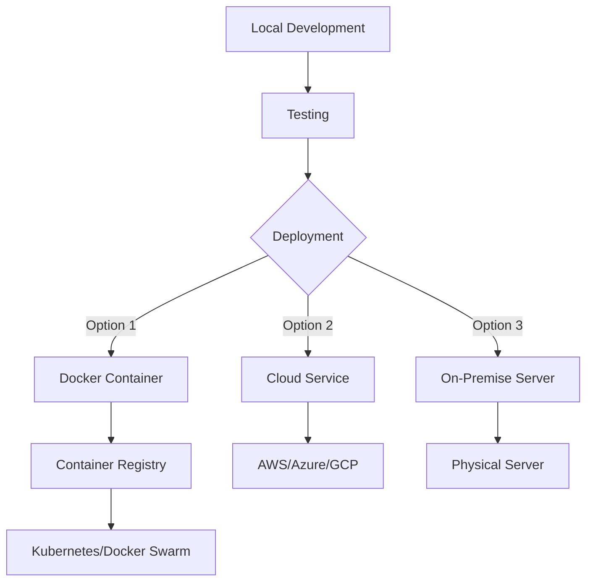

## Performance Considerations

- **Database Indexing**: All tables have indexed primary keys and timestamp fields
- **Connection Pooling**: Efficient database connection management
- **Caching**: Frequently accessed data can be cached
- **Pagination**: All list endpoints support pagination for large datasets

## Monitoring and Logging

The application includes comprehensive logging:

- **Request Logging**: All incoming requests are logged with timestamp, method, and URL
- **Error Logging**: Detailed error logs include stack traces in development mode
- **Graceful Shutdown**: Proper handling of server shutdown with connection cleanup

### Log Example

```
[2023-07-15T14:32:45.123Z] GET /api/location
[2023-07-15T14:32:45.234Z] POST /api/car-control
[2023-07-15T14:32:45.345Z] ERROR: Invalid action parameter - 400 Bad Request
```

## Database

The application uses SQLite with a file-based database (`database.db`). The database will be created automatically when you start the application for the first time.

## License

This project is licensed under the MIT License - see the LICENSE file for details.
